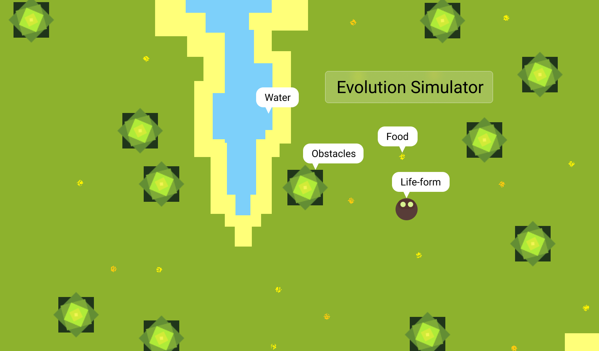

# Evolution Simulator
Evolution Simulator is a project inspired by a [Video](https://www.youtube.com/watch?v=r_It_X7v-1E&t=3s) in Youtube by [Sebastian Lague](https://www.youtube.com/channel/UCmtyQOKKmrMVaKuRXz02jbQ). It is basically an **eco-system** where an AI life-form will try to survive. After each simulation, data collected will be used plot graphs to understand the AI's decisions. The life-form will have a random life-expectency and it have to search for **Food** and **Water** in the eco-system to survive and partners to re-produce and pass **DNA** to next generation.

### Concept:

### Technologies to used:
- ReactJS
- JavaScript
